  

프론트엔드 3년 6개월 뒤, 1년 4개월 동안 **백엔드와 운영 어드민을 혼자 맡아 서비스 3개를 앱스토어·플레이스토어에 출시**했습니다.
혼자서도 속도와 품질을 지킬 수 있었던 건 **Claude Code로 개발 과정 자체를 설계**했기 때문입니다.

## ⚡ Highlights

<table>
<tr>
<td width="50%" valign="top">

**🍽️ 위브닝** 소셜 다이닝 · 2026 
백엔드 전체와 운영자 어드민 웹을 혼자 개발해 스토어 출시, Apple/Google 인앱결제 전환

`API 110` `테스트 1,610` `커버리지 95.8%`

</td>
<td width="50%" valign="top">

**📚 아이리딩** 독서 기록 B2B · 2025– 
백엔드 전체 단독 개발, 대량 도서 등록의 N+1 제거

`등록 2분 → 20초` `테스트 스펙 6 → 30`

</td>
</tr>
<tr>
<td width="50%" valign="top">

**🚚 Push** 푸드트럭 예약·결제 · 2025 
예약 → 결제 → 환불 라이프사이클을 트랜잭션 인터셉터로 설계

`API 76` `사용자·사장님 앱 2개를 한 서버로`

</td>
<td width="50%" valign="top">

**🖥️ 빌리오** 공간 예약 B2B · 2021–2025 
프론트엔드 3년 6개월, API 스펙을 먼저 합의하는 프로세스 정착

`모바일 유저 +40%` `MAU +20%`

</td>
</tr>
</table>

## 🤖 How I build with AI

혼자 개발할 때 가장 위험한 건 코드를 봐줄 사람이 없다는 것입니다. 그래서 리뷰어 역할을 에이전트에 나누고, 사람이 승인하는 지점을 정해 두었습니다.

> `plan` → `critique` → 👤 `approve` → `implement` → `review`

- **계획을 먼저 공격** — 구현 전에 비판 에이전트가 계획의 빈틈을 찾고, 사람이 승인해야 구현이 시작됨
- **훅으로 강제** — 파일을 고치면 관련 테스트가 바로 돌고, 전체 테스트가 통과하기 전엔 작업이 끝나지 않음
- **결과** — 위브닝에서 PR당 변경 파일 **−31%**, 주당 머지 PR **+28%**
- **2모델 교차 검증** — 원인 분석은 Codex, 구현은 Claude Code. 한 모델의 오진이 그대로 코드가 되지 않게
- 이 구성을 누구나 쓸 수 있게 템플릿으로 공개했습니다 → [**harness-template**](https://github.com/SungSeokMin/harness-template)

## 🛠 Stack

**Domain** · 예약·결제·정산 · Apple/Google 인앱결제 · 실시간 채팅(Socket.IO) · 푸시(FCM) · 동시성 제어

